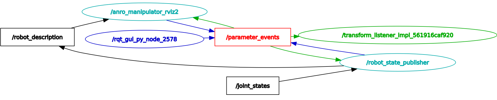
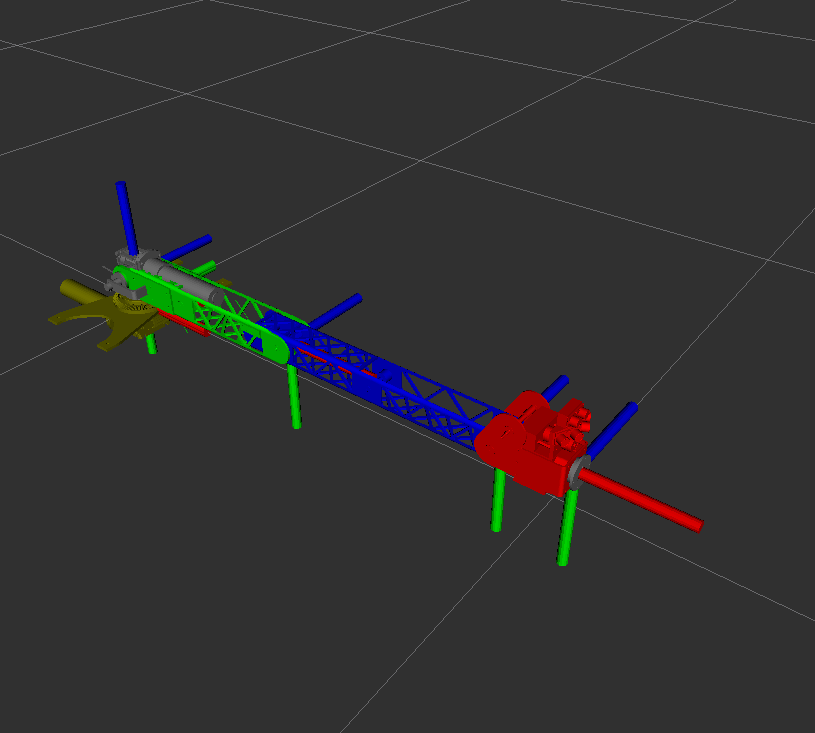

# anro_manipulator
Paczka stworzona na potrzeby drugich laboratoriów. Znajduje się w niej model manipulatora oraz prosty node sterujący pozycją manipulatora.
## Usage
### Konwerter D-H - `dh_converter.py`
Jest to skrypt odpowiadający za wygenerowanie współrzędnych zgodnych z urdf na podstawie tablicy D-H. Przyjmuje dwa obowiązkowe argumenty:
- `-i` lub `--Input`
  Ścieżka wejściowa do pliku json zawierającego tablicę D-H
- `-o` lub `--Output`
  Ścieżka wyjściowa w której ma zostać zapisany plik yaml zawierającego współrzędne zgodne z urdf.
  ```
  python3 dh_converter.py -i=<INPUT_PATH> -o=<OUTPUT_PATH>
  ```
### Launch files
- `manipulator.launch.py`  
  Uruchamia `state_publisher` z paczki `anro_manipulator`
  ```
  ros2 launch anro_manipulator manipulator.launch.py
  ```  
  
- `rviz_fixed.launch.py`  
  Uruchamia jednocześnie `robot_state_publisher` z paczki `robot_state_publisher` oraz `rviz2` z paczki `rviz2`. Do `robot_state_publisher` zostaje przekazany plik `manipulator.fixed.urdf.xml`. Do `rviz2` zostaje przekazany plik konfiguracyjny `manipulator.rviz`.
  ```
  ros2 launch anro_manipulator rviz_fixed.launch.py
  ```
  
- `rviz.launch.py`  
  Uruchamia jednocześnie `robot_state_publisher` z paczki `robot_state_publisher` oraz `rviz2` z paczki `rviz2`. Do `robot_state_publisher` zostaje przekazany plik `manipulator.urdf.xml`. Jeżeli argument `fixed` ustawiono na `true`, to do `robot_state_publisher` zostaje wtedy przekazany plik `manipulator.fixed.urdf.xml`. Do `rviz2` zostaje przekazany plik konfiguracyjny `manipulator.rviz`.
  ```
  ros2 launch anro_manipulator rviz.launch.py
  ```
  
## Topics
### Published topics
- `/joint_states`
- `/tf`

## URDF
W tym folderze znajdują się wszystkie pliki związane z modelem manipulatora. Dla plików rozszerzeniem `.xacro.xml` są automatycznie generowane odpowiadające im pliki `.urdf.xml`. Dla plików `.fixed.xacro.xml` dodatkowo generowany jest plik `.fixed.urdf.xml`, pliki xacro z takim rozszerzeniem powinny przyjmować opcjonalny argument `fixed`. Dla każdego pliku `.xacro.xml` kownertowany jest również plik z rozszerzeniem `.json` na plik z rozszerzeniem `.yaml`, z którego model xacro powinien wczytać parametry.
### Tablica D-H - `manipulator.json`
Tablica json do której wpisuje się kolejne wiersze tabeli D-H. Tablica ta jest automatycznie konwertowana na plik `manipulator.yaml`, z którego są wczytywane parametry do pliku `manipulator.fixed.xacro.xml`  
Tabela D-H manipulatora:  
|   | a<sub>i-1</sub> | α<sub>i-1</sub> | d<sub>i</sub> | Φ<sub>i</sub> |
|---|-----------------|-----------------|---------------|---------------|
| 1 | 0               | 0               | d<sub>1</sub> | Φ<sub>1</sub> |
| 2 | 0               | 0               | d<sub>2</sub> | 0             |
| 3 | 0               | -90             | 0             | Φ<sub>3</sub> |
| 4 | a<sub>3</sub>   | 0               | 0             | Φ<sub>4</sub> |
| 5 | a<sub>4</sub>   | 0               | 0             | Φ<sub>5</sub> |
| 6 | a<sub>5</sub>   | 0               | 0             | 0             |

Robot ma 4 stopnie swobody, drugi wiersz jest dodany na potrzeby generowania modelu urdf, a 6 wiersz dodaje narzędzie bez stopni swodoby. Zmienne Φ<sub>1</sub>, Φ<sub>3</sub>,Φ<sub>4</sub>,Φ<sub>5</sub> dodają stopinie swobody odpowiedzialne za obroty stawów. 
### Model - `manipulator.fixed.xacro.xml`
Model w formacie xacro, który jest automatycznie konwertowany na odpowiadające mu pliki urdf `manipulator.urdf.xml` oraz `manipulator.fixed.urdf.xml`. Pobiera on parametry z pliku `manipulator.yaml` oraz przyjmuje opcjonalny argument `fixed`. Dla `fixed=true` generowany plik urdf ma zablokowane stawy.
- `manipulator.urdf.xml`  
  
- `manipulator.fixed.urdf.xml`  
  
### Konfiguracja RVIZ2 - `manipulator.rviz`
Domyślna konfiguracja RVIZ2 wyświetlająca model manipulatora.

### Autorzy
- Gabriel Brzeziński (gabrysbrzezinski@gmail.com)  
- Kacper Nowakowski (casperus99@wp.pl) 
